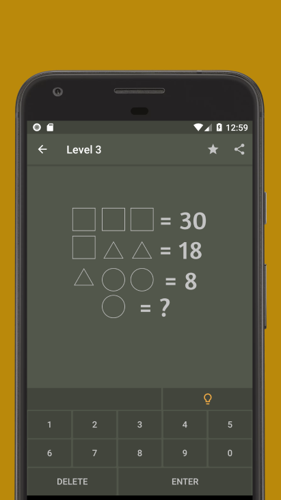
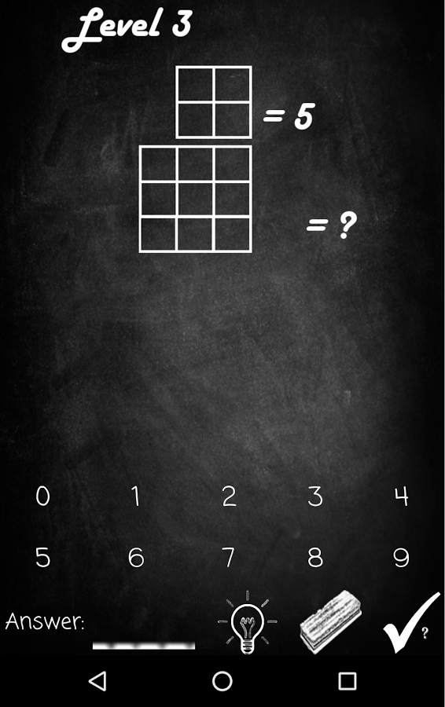
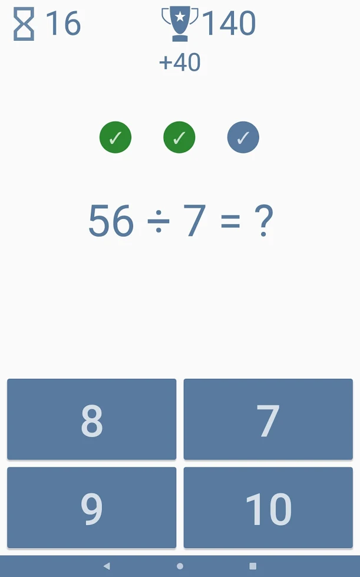
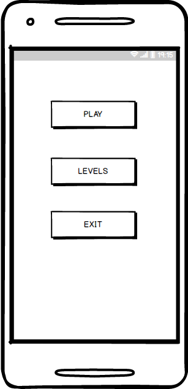
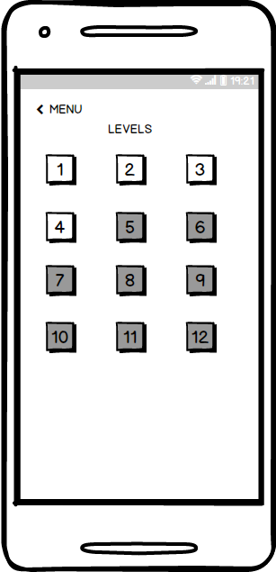
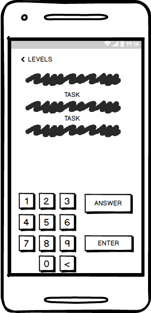

# Требования к проекту
---

# Содержание
1 [Введение](#intro)  
1.1 [Назначение](#appointment)  
1.2 [Бизнес-требования](#business_requirements)  
1.2.1 [Исходные данные](#initial_data)  
1.2.2 [Границы проекта](#project_boundary)  
1.3 [Аналоги](#analogues)  
2 [Требования пользователя](#user_requirements)  
2.1 [Программные интерфейсы](#software_interfaces)  
2.2 [Интерфейс пользователя](#user_interface)  
2.3 [Характеристики пользователей](#user_specifications)  
2.3.1 [Целевая аудитория](#target_audience)  
2.4 [Предположения и зависимости](#assumptions_and_dependencies)  
3 [Системные требования](#system_requirements)  
3.1 [Функциональные требования](#functional_requirements)    
3.1.1 [Основные функции](#main_functions)      
3.1.2 [Ограничения и исключения](#restrictions_and_exclusions)      
3.2 [Нефункциональные требования](#non-functional_requirements)    
3.2.1 [Атрибуты качества](#quality_attributes)  

<a name="intro"/>

# 1 Введение

<a name="appointment"/>

## 1.1 Назначение
В этом документе описаны функциональные и нефункциональные требования к мобильному приложению «Puzzle of Math». Этот документ предназначен для команды, выполняющей разработку и контроль проекта.
<a name="business_requirements"/>
## 1.2 Бизнес-требования

<a name="initial_data"/>

### 1.2.1 Исходные данные
Успех как на работе, так и в личной жизни определяет наша способность быстро мыслить и запоминать информацию, учиться, делать логические выводы и приводить их в действие.
«Puzzle of Math». – это приложение для тренировки ума, развивающее концентрацию, скорость мышления, память, математические навыки, устный счет!
Математические загадки позволят раскрыть ваш математический талант, когда вы проходите интеллектуальные игры, скрытые в геометрических формах. Вы будете тренировать оба полушария мозга, исследуя отношения между числами в геометрических формах. Так вы серьезно расширите границы своего ума.
 
<a name="project_boundary"/>

### 1.2.2 Границы проекта
Математические загадки с логическими головоломками повысят уровень вашего интеллекта.
В интеллектуальных играх использован тот же подход, что и в тесте IQ.

<a name="analogues"/>

## 1.3 Аналоги
1.	Математические головоломки, головоломки для всех.

 

2.	Математические игры - упражнения для мозга.

 

3.	Математические головоломки

 

<a name="user_requirements"/>

# 2 Требования пользователя

<a name="software_interfaces"/>

## 2.1 Программные интерфейсы
Приложение реализовано для операционной системы Android, с помощью языка Java.
Для хранения вопросов и результатов будет использована облачная база данных Firebase.(???)

<a name="user_interface"/>

## 2.2 Интерфейс пользователя
1.	Главное меню. 

 

2.	Выбор уровня.  

 

3.	Игровое окно.  

 

<a name="user_specifications"/>

## 2.3 Характеристики пользователей

<a name="target_audience"/>

### 2.3.1 Целевая аудитория
Приложение отлично подходит как детям, делающим свои первые шаги в изучении математики, так и взрослым, любящим интересные головоломки и задачи. 

<a name="assumptions_and_dependencies"/>

## 2.4 Предположения и зависимости
Все уровни подходят для взрослых и детей. Со стороны пользователей требуются минимальные навыки пользования мобильным устройством c ОС Android.
<a name="system_requirements"/>

# 3 Системные требования

<a name="functional_requirements"/>

### 3.1 Функциональные требования
Работа приложения осуществляется на платформе Android.

<a name="main_functions"/>

### 3.1.1 Основные функции

Приложение предоставляет пользователю следующие возможности:
1. 	Выбор уровня сложности;
2. 	Получение оценки выполненного задания;

<a name="restrictions_and_exclusions"/>

### 3.1.2 Ограничения и исключения

1.	Работа приложения осуществляется на платформе Android минимальной версии 4.0.3.

## 3.2 Нефункциональные требования

<a name="quality_attributes"/>

### 3.2.1 Атрибуты качества
1.	Использование выдержанной для всего приложения цветовой гаммы;
2.	Useability интерфейс;
3.	С повышением уровня, увеличивается сложность задания;

